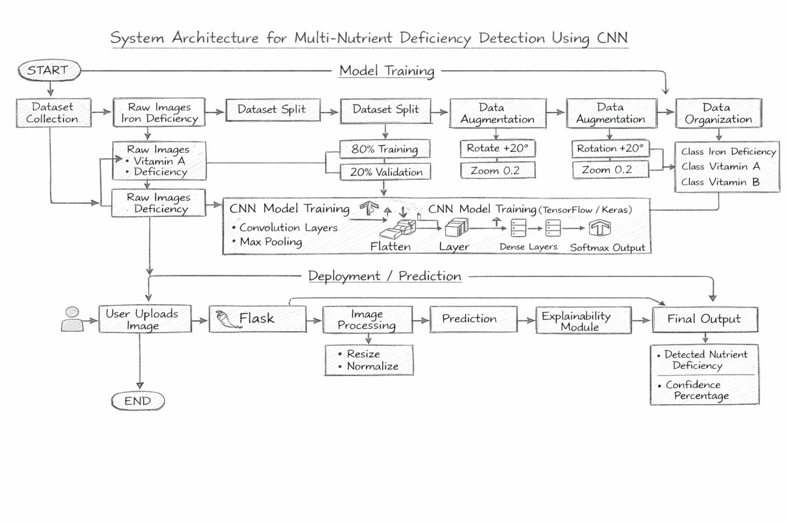
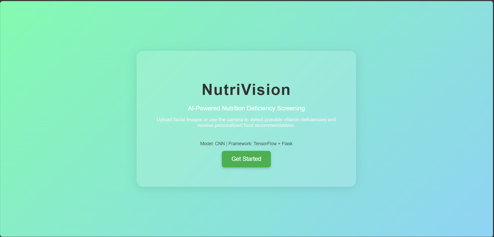
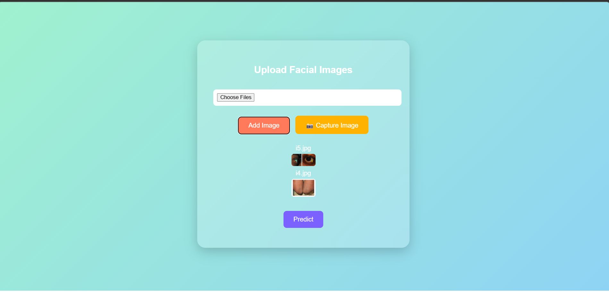
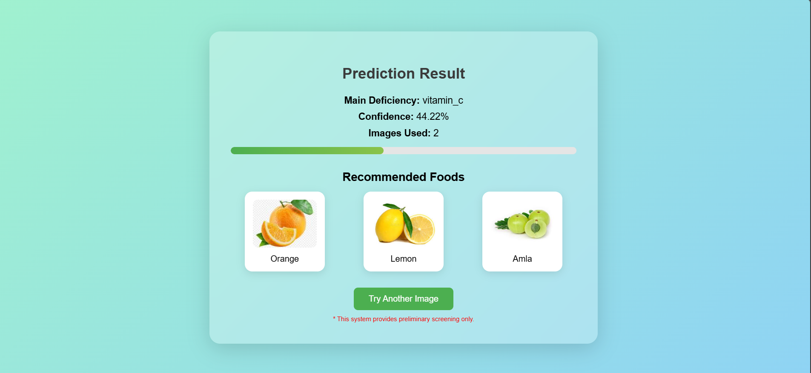

# NutriVision – AI-Based Nutrition Deficiency Detection

NutriVision is a computer vision system that detects possible **nutritional deficiencies from facial images** using a Convolutional Neural Network (CNN).
The system analyzes facial features such as **skin tone, lip texture, and facial discoloration** and predicts deficiencies like **Vitamin A, Vitamin B, Vitamin C, Vitamin D, Vitamin E, and Iron deficiency**.

---

## Project Overview

Traditional nutrition deficiency diagnosis requires laboratory tests which are **costly, time-consuming, and not easily accessible in rural areas**.

NutriVision provides a **preliminary AI-based screening tool** that analyzes facial images and predicts potential deficiencies using deep learning.

---

## System Architecture



---

## Technologies Used

* Python
* TensorFlow / Keras
* OpenCV
* Flask
* HTML / CSS / JavaScript

---

## Features

* AI-based facial image analysis
* Multi-image prediction
* Nutrition deficiency detection
* Food recommendation system
* Web-based interface
* Health score estimation

---

## Project Structure

```
Nutrition_Deficiency_Detection
│
├── app
│   ├── app.py
│   ├── templates
│   └── static
│
├── dataset
│   ├── raw_images
│   └── combined
│
├── models
│   ├── cnn_model.py
│   └── trained_model.h5
│
├── preprocessing
│   ├── face_detection.py
│   ├── image_preprocessing.py
│   └── region_extraction.py
│
├── classification
│   ├── train_model.py
│   └── predict.py
│
├── notebooks
│   ├── data_analysis.ipynb
│   └── model_training.ipynb
```

---

## Example Output

The system predicts the **most likely deficiency and confidence score** and recommends foods to improve nutrition.

Example:

```
Main Deficiency: Vitamin B  
Confidence: 82%  

Recommended Foods:
Egg, Milk
```

---
## Application Interface

### Home Page


### Image Upload


### Prediction Result


---

## Disclaimer

This system provides **preliminary screening only** and is **not a medical diagnosis tool**.
